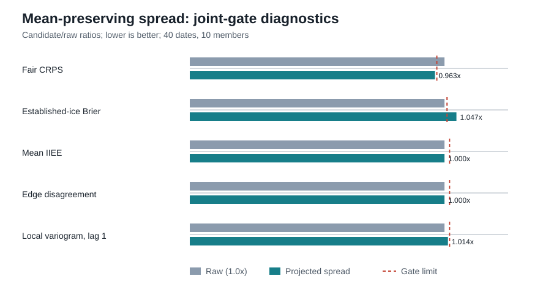

# Auditing Reliability in Generative Data Assimilation under Sparse Spatial Observations

## Amended primary decision policy

External primary evidence state: RECONCILED_NEGATIVE

All completed gates in this draft are development evidence. None of their
historical `overall_eligible` values is final primary success. The frozen
primary evaluation requires an absolutely good randomized rank histogram and
truth-referenced high-SIC diagnostics at `q={0,.15,.90,.95,.99}`; relative rank
improvement alone is insufficient. Masses `>=.999` and exact-one remain useful
encoding diagnostics but are not boundary acceptance criteria. The exact
contract identities and controller preflight are recorded in
`AMENDED_PRIMARY_EVALUATION_CONTRACT.md`.

> Validation-mechanism draft with a reconciled negative independent primary.
> See
> `CLAIM_LEDGER.md` and `PUBLICATION_READINESS.md` for provenance, minimum-tier
> blockers and limitations. This document reports an independent falsification
> of the frozen calibration claim, not a successful calibrated ensemble.

## Independent primary result

The exact permitted truth-normalization recovery
`external_2024_calendar_global_bias_confirm48_primary_retry2` of the frozen
confirmatory CPU stage completed all 48 cases. The superseded `retry1` metrics
are excluded from all scientific interpretation. The signed compact payload
verifies the source identity, 48 raw and
48 truth hashes, all 480 member records, the pre-truth candidate seal, and
formation of every candidate array before scoring truth was opened. The frozen
`calendar_global_bias_mixture_v1_refit_all40` candidate is not jointly eligible:
`overall_eligible=false`. Proper scores, absolute rank reliability,
truth-relative boundary calibration and spatial/physical preservation fail;
only operational validity passes.

The candidate worsens fair CRPS from `0.05541808434196047` to
`0.061833300537408264`. It also worsens an already low normalized mean rank:
the raw value is `0.23610946912844127` and the candidate value is approximately
`0.225`, farther from `0.5`. Under the no-compensation rule, the failed proper-score,
absolute-rank, truth-relative-boundary and spatial/physical families independently
reject the frozen calibration claim; no retuning or additional external evaluation
follows.

## Abstract

Conditional generative models provide a computationally attractive route to
ensemble data assimilation, but a collection of plausible spatial samples is
not necessarily a reliable predictive ensemble. This distinction is especially
important in practice, where only a small number of members is generated and
the assimilated field can be bounded and zero-inflated. We study conditional
flow-based data assimilation for Arctic sea-ice concentration using a dense
model background and sparse observations under real satellite-track geometry.
On 40 validation dates, a learned joint-conditioning ensemble improves the
background ensemble-mean RMSE but is strongly underdispersed. We therefore
freeze a deliberately simple postprocessing rule: in each of five deterministic
date-stratified folds, select one global multiplicative anomaly scale on the
other 32 dates by fair CRPS, then apply it to the eight held-out dates. Selected
scales are 2.6, 2.7, 2.8, 2.8 and 2.6. Cross-fitted fair CRPS decreases from
0.058491 to 0.055690 (4.79%), ordinary CRPS decreases from 0.062108 to 0.061101,
and spread-skill ratio changes from 0.7241 to 1.0615. The paired fair-CRPS
change is -0.002801 (date-bootstrap 95% CI -0.004132 to -0.001354; post-hoc
four-date-block sensitivity -0.005026 to -0.000290). The nominal 90% interval
diagnostic rises from 0.5051 to 0.8788. The transform preserves the ensemble
center before bounded-score clipping to numerical precision. These validation
results support a narrow diagnosis of predominantly global underdispersion. A
predeclared joint audit nevertheless rejects the correction as a well-calibrated
ensemble: clipping creates a large spurious exact-one atom, established-ice
Brier score worsens by 2.15%, and IIEE and edge disagreement worsen beyond their
2% tolerances. We then test a frozen, mechanistically diverse suite spanning
bounded marginal models with ECC-Q, exact mean-preserving transports, coherent
member offsets, historical residual fields, guidance mixing and latent-space
inflation. None passes the common development gate: methods that materially
improve ranks or coverage either degrade proper scores, boundary behaviour or
spatial structure, whereas topology- and boundary-preserving constructions
select an inactive correction. The contribution is therefore an auditable
failure map and a fail-closed evaluation protocol, not a successful calibrated
ensemble, an independent generalization claim or superiority to a deterministic
method.

## 1. Introduction

Diffusion models, flow matching and stochastic interpolants have made it
possible to sample high-dimensional conditional distributions at useful
spatial resolutions [1,2]. In data assimilation, this offers a compelling
alternative
to a single optimized analysis: the output can be an ensemble that represents
multiple states compatible with a physical background and sparse observations.

Yet generative fidelity and probabilistic reliability are different targets.
An ensemble mean may be accurate while the members are underdispersed; an
aggregate proper score may improve while interval coverage deteriorates; and a
pointwise marginal correction may destroy fronts, connectivity or dependence
between distant locations. These problems are hidden further when an expensive
generative model is evaluated with only 5–20 members. Nominal quantiles are then
poorly resolved, conventional ensemble CRPS contains a finite-sample component,
and uncorrected spread-skill ratios do not have an ideal value of one under the
same conventions.

Our motivating application is model-to-model assimilation of Arctic sea-ice
concentration. We condition a learned generator on a dense forecast-like
background and sparse concentration values sampled under real SRAL footprint
geometry. The setting combines several difficult properties: the field is
bounded in `[0,1]`, more than half of evaluated ocean pixels can be exactly zero,
the observation geometry changes daily, and scientifically relevant error is
concentrated near the ice edge.

This draft begins with an empirical finding. A stronger observation-guidance
weight improves validation RMSE, empirical CRPS and withheld-track skill. A
regularized affine-logit transformation further improves blocked-validation
CRPS and RMSE, but removes exact zero mass and sharply worsens coverage. Thus
score optimization alone does not solve the calibration problem.

### Contributions supported by the present evidence

The present validation study contributes:

1. **Finite-ensemble-aware evaluation.** We distinguish
   empirical-distribution scores from fair ensemble estimators and derive or
   document attainable reliability targets for small ensembles.
2. **A mean-preserving global spread correction.** We cross-fit a single
   multiplicative anomaly scale, preserving member ranks and the pre-clipping
   ensemble center, and report both ordinary and fair CRPS.
3. **An auditable sparse-observation protocol.** We record the conditioning
   channels, real footprint geometry, model-to-model observation values, frozen
   checkpoint and deterministic cross-fitting procedure.
4. **A mechanistically diverse negative-calibration suite.** We show why
   score improvement from an affine-logit transform is insufficient when it
   destroys exact boundary mass, and why a fixed purged hurdle-isotonic/ECC-Q
   construction can repair boundary masses and randomized ranks while severely
   degrading proper scores and spatial skill. An exact capped-simplex projection
   then preserves the raw mean and every audited mean-field diagnostic while
   showing that spread-only repair still fails boundary, inner-order and
   member-spatial criteria. A final fixed open-logit desaturation removes hard
   upper-cap saturation and repairs the inner-order criterion, but still fails
   boundary and member-spatial safety. Finally, a frozen zero/one-inflated
   Beta EMOS marginal model with ECC-Q improves boundary masses and randomized
   ranks, but fails proper-score, inner-order, boundary and spatial families.
   Four further frozen tests separate dependence preservation from usable
   dispersion: topology-preserving stratified transport preserves boundary and
   spatial structure but selects no effective correction; historical residual
   dressing improves reliability while damaging proper scores and physical
   fields; a fixed guidance mixture fails every scientific family; and coherent
   member offsets, with and without projection, select the null action. Together
   these are mechanism falsifications under one no-compensation gate, not a
   claim that all calibration families have been exhausted.

The methods and gates are frozen from validation evidence. Independent
evaluation, multi-seed training and broader generalization remain outside the
present claim. These negative constructions do not exhaust the strong
distributional, conformal or probabilistic-DA baseline families required for a
submission-ready comparison.

A frozen model-space diagnostic multiplied every initial latent by `1.30`
before the unchanged ODE solve. It improved all finite-ensemble reliability
criteria, including randomized-rank discrepancy from `0.0790135` to
`0.00990828`, but worsened fair CRPS from `0.0584906` to `0.0631177` (paired
delta `0.00462716`, date-bootstrap 95% CI `[0.00143557, 0.00759567]`) and
ordinary CRPS from `0.0621083` to `0.0684128`. Boundary and spatial/physical
families also failed: exact-one mass error rose from `0.00904188` to
`0.0638730`, edge disagreement from `0.0351291` to `0.0397475`, and local and
member variogram safeguards failed. Thus `overall_eligible=false`; latent
temperature repairs ranks by adding diversity that is too large and physically
unsafe, and no second temperature is selected.

The predeclared locked-MC-dropout fallback was subsequently recovered from its
completed server-side samples without GPU recomputation and evaluated under its
unchanged gate. The exact frozen candidate
`locked_mc_dropout_p010_final_ema_ensemble` also has
`overall_eligible=false`. This closes that model-stochasticity mechanism without
changing the probability, admitted layers, locked-mask construction or seed
schedule, and it is the precondition for the final iid calendar global-bias
fallback reported below.

## 2. Conditional generative assimilation

Let `x` denote the target sea-ice state, `b` a dense background and `o` sparse
track observations with mask `m`. The trained conditional vector field supports
unconditional, background-only, observation-only and jointly conditioned
branches. At inference, independent guidance uses

\[
v = v_\varnothing
  + (1-w)(v_b-v_\varnothing)
  + w(v_o-v_\varnothing),
\]

with a zero coefficient for the joint branch. This gives a post-training control
over the balance between the dense background and sparse observations.

The strict comparison evaluates only sea-ice concentration. Thickness inputs
and masks are zeroed, although the legacy network retains two output channels.
Track conditioning uses footprints for the target date and two preceding days;
newer observations overwrite older values on overlap. A next-day footprint,
not used in conditioning, provides a sparse track-imitation diagnostic.

## 3. Why finite ensembles complicate calibration

For `M` generated members, the empirical ensemble CRPS and the fair score for
an underlying sampling distribution use different pairwise normalizations. The
latter removes the self-pair finite-sample bias [3] and is required when ensemble
sizes differ or when dispersion is interpreted as a property of the underlying
generator.

Likewise, order-statistic intervals from a small exchangeable ensemble have
discrete attainable coverage. With `M=10`, even the member range has expected
coverage `9/11` under continuity and exchangeability. Interpolated 5% and 95%
sample quantiles therefore must not be interpreted as a literal 90% predictive
interval without a continuous predictive model or an explicit finite-ensemble
construction. Randomized ranks provide a more direct exchangeability check.

We report ordinary ensemble CRPS alongside fair CRPS, using the latter as the
scale-selection objective. Coverage remains a descriptive interval diagnostic
for the ten-member ensemble rather than a literal continuous-distribution
guarantee. CRPS is interpreted as a proper scoring rule for a predictive
distribution [4].

## 4. Cross-fitted global spread calibration

For members `x_k` and their pointwise ensemble mean `x_bar`, the frozen method
forms `x'_k = x_bar + s(x_k - x_bar)`. Values are clipped to `[0,1]` only when
bounded scores are computed. Five folds are assigned deterministically by date
strata. For each holdout fold, `s` minimizes daily case-mean fair CRPS on the
other four folds over the predeclared grid 1.0, 1.1, ..., 4.0. Each fold has 32
selection dates and eight held-out dates; every reported calibrated case is
therefore scored out of fold.

The selected scales (2.6, 2.7, 2.8, 2.8 and 2.6) are interior and stable across
folds. This supports the mechanism interpretation that the learned-joint
ensemble's proper-score deficit is largely a global spread error. Because
clipping can move the bounded ensemble mean, any post-clipping RMSE change is a
secondary numerical consequence, not evidence that the method improves the
unclipped center.

## 5. Experimental protocol

The present mechanism study uses 40 dates from the development split. The
checkpoint, case set, ensemble size, cross-fitting folds, scale grid and scoring
rules are fixed for the analysis reported here. The checkpoint is a legacy
final-epoch checkpoint, so the study is explicitly presented as a
validation-mechanism result rather than an independent generalization result.

The primary deterministic quantity is the generated ensemble mean, which is
compared with the single 3D-Var analysis. Probabilistic scores apply only to the
generative and probabilistic baselines. Uncertainty resamples dates, never
individual pixels. We report a paired date-bootstrap interval and a post-hoc
circular contiguous four-date-block temporal sensitivity from the trusted
compact analysis.

The reported baselines are the raw ensemble, the score-optimized affine-logit
negative baseline, cross-fitted global anomaly scaling, and a fixed purged
hurdle-isotonic bounded distribution reconstructed with ECC-Q [5]. The latter is a
boundary-aware and rank-preserving negative mechanism baseline: it repairs the
boundary-mass and randomized-rank diagnostics but fails the proper-score and
spatial/physical families decisively. This single failed construction does not
exhaust strong SIC distributional, conformal or probabilistic-DA baselines, so
the minimum strong domain/SciML baseline tier remains incomplete.

We additionally evaluate the frozen cross-fitted scales followed by an exact
capped-simplex projection of each ten-member pixel distribution. The projection
preserves the raw ensemble mean while enforcing bounded members and preserving
strict rank order. It is a targeted mechanism test, not a newly tuned method.

## 6. Preliminary validation results

On the same 40 validation dates with ten generated members, changing the
track/background weights from `0.5/0.5` to `0.625/0.375` changes full-field
ensemble-mean RMSE from `0.21291` to `0.20366`, empirical CRPS from `0.07070`
to `0.06609`, and IIEE from `0.08767` to `0.08537`. At `w=0.625`, the analysis
improves background RMSE from `0.25603` to `0.20366`; on the next withheld
track, RMSE improves from `0.19046` to `0.12384`.

The improvement is regime-dependent. Preliminary read-only analysis indicates
that CRPS improves predominantly in established ice and can worsen at exact
zero and in marginal ice. This motivates a boundary-aware method rather than a
single global transform.

A four-fold temporally blocked affine-logit search changes cross-validated
development empirical
CRPS from `0.06609` to `0.06092` and ensemble-mean RMSE from `0.20366` to
`0.19428`. This is not evidence of successful calibration. The transform clips
exact zeros before applying a logit and returns no exact zero after inversion.
Across the out-of-fold transforms, the current nominal 90% interval diagnostic
falls from `0.646` to `0.367`, while member-range coverage falls from `0.722`
to `0.396`. Exact zero occurs on `53.6%` of truth pixels and `24.6%` of raw
member pixels, but on no calibrated member pixels. Although the finite-ensemble
targets for these interval statistics require correction, the transformation's
boundary failure is unambiguous. Repeated refinement on the same 40 dates also
makes the final blocked estimate meta-adaptive rather than locked.

For the learned-joint ensemble, five-fold cross-fitted global spread calibration
selects scales `2.6, 2.7, 2.8, 2.8, 2.6`. Fair CRPS changes from `0.0584905850`
to `0.0556896736`, a `4.79%` reduction, while ordinary CRPS changes from
`0.0621082810` to `0.0611013421`. Spread-skill ratio changes from `0.724066` to
`1.061484`. Coverage diagnostics change from `0.208196` to `0.596277` (50%),
`0.471026` to `0.856292` (80%), `0.505084` to `0.878775` (90%), and `0.525005`
to `0.891464` (95%). The maximum pre-clipping mean-invariance error is
`4.16e-16`. Bounded ensemble-mean RMSE changes from `0.1903366` to `0.1876254`,
but clipping can cause this difference and it is not attributed to center-skill
improvement. The 95% diagnostic remains below its nominal level, so the result
does not establish complete tail calibration.

The subsequent fixed-contract joint audit applies the predeclared
no-compensation gate to all 40 cases. Although the proper-score family passes,
the boundary and spatial/physical families do not. Established-ice Brier score
increases from `0.0569726` to `0.0581999` (2.15%, versus a 1% tolerance).
Exact-one member mass increases from `0.0090419` to `0.1648321` despite zero
truth mass, consistent with clipping inflated anomalies at the upper bound.
Mean IIEE [6] increases from `0.0796004` to `0.0839798` (5.50%), edge disagreement
from `0.0351291` to `0.0366784` (4.41%), and absolute ice-extent error from
`0.0461536` to `0.0507921` (10.05%). Global spread correction is therefore a
negative mechanism baseline: it repairs marginal underdispersion by proper
scores but is not a structure-preserving calibration method.

The paired 40-date analysis supports the fair-CRPS reduction: the mean delta is
`-0.00280091`, with date-bootstrap 95% CI `[-0.00413219, -0.00135419]` and
post-hoc circular four-date-block CI `[-0.00502644, -0.000290285]`; 33 of 40
dates improve. The smaller ordinary-CRPS delta (`-0.00100694`) is uncertain:
its date CI `[-0.00226205, 0.000370390]` and block CI
`[-0.00304748, 0.00132497]` cross zero. Bounded ensemble-mean RMSE decreases by
`-0.00271125`, with both intervals below zero, but remains a clipping-affected
secondary diagnostic. Conversely, mean IIEE worsens by `0.00437938`, and both
intervals are above zero (date `[0.00206475, 0.00671611]`; block
`[0.00114932, 0.00784928]`). Thus paired uncertainty sharpens rather than
reverses the joint-gate decision.

The fixed purged hurdle-isotonic/ECC-Q comparator gives a complementary
negative result. Five contiguous eight-date holdouts, separated from fitting
data by a three-case purge, produce finite outputs for all 40 cases and no ECC
rank-order violations. Relative to raw, exact-zero mass absolute error falls
from `0.396859` to `0.013451`, exact-one mass absolute error from `0.009042` to
`0`, and randomized-rank discrepancy per point-case from `0.079014` to
`0.005308`. These improvements do not translate into a useful predictive
ensemble. Fair CRPS rises from `0.058491` to `0.085581` (paired delta
`0.027091`, date-bootstrap 95% CI `[0.021732, 0.032111]`; post-hoc four-case
block CI `[0.017398, 0.035924]`), and ordinary CRPS rises from `0.062108` to
`0.097714`. Ensemble-mean RMSE rises to `0.268421`, mean IIEE to `0.183385`,
edge disagreement to `0.305843`, and energy-score RMS to `0.197985`. The result
falsifies the hypothesis that this fixed marginal hurdle fit plus raw-rank
ECC-Q can jointly repair reliability and preserve spatial skill. It remains a
high-value negative ablation because it separates successful boundary/rank
repair from severe loss of conditional interior and spatial fidelity.

The mean-preserving capped-simplex mechanism removes center shift as an
explanation for the global-spread tradeoff. All 40 cases complete, the maximum
mean error is `3.87e-16`, and bounded ensemble-mean RMSE, mean IIEE, edge,
area/extent and mean-field variograms equal raw. Fair CRPS falls from
`0.058491` to `0.056300` (3.75%); the paired delta is `-0.00219049`, with
date-bootstrap 95% CI `[-0.00297734, -0.00139088]` and post-hoc four-case-block
CI `[-0.00340517, -0.000862635]`. Randomized-rank discrepancy and member-range
error also improve. Nevertheless, `overall_eligible=false`: inner-order error
does not improve, established-ice Brier score rises from `0.056973` to
`0.059650`, and local/member variogram tolerances fail. Although avoidable
exact-one mass is eliminated, upper-cap mass reaches `0.167438`; therefore
absence of a literal exact-one atom is not sufficient evidence of boundary
safety. This test falsifies the sufficiency of exact mean-preserving spread
correction while retaining its proper-score and rank mechanism signal.

The final fixed open-logit diagnostic isolates hard upper-cap saturation. It
inherits the projected candidate's zero mask and frozen transferred scales,
uses an open-logit member transform, and solves a per-pixel intercept to retain
the raw ensemble mean. Fair CRPS falls further to `0.055738`; randomized-rank
discrepancy per point-case falls to `0.011764`, and inner-order attainable-
coverage error improves from `0.175953` raw and `0.185472` capped to `0.148343`.
The upper-cap mass is zero and the maximum mean error is `4.57e-16`. This
candidate nevertheless remains ineligible. Established-ice Brier is `0.059107`
versus `0.056973` raw, mass above `0.999` is `0.071936` versus `0.010862`, and
both local- and member-variogram safety families fail. Thus hard-cap removal
explains the capped method's inner-order failure but is not sufficient for
boundary-safe, spatially reliable calibration. This was the final fixed
diagnostic; no transform bounds, zero masks or transferred scales were tuned
after its result.

The frozen ZOIB-EMOS/ECC-Q comparator tests a distinct parametric route with
explicit zero and one atoms. All 40 cases complete, every fold converges and
ECC-Q produces no strict rank-order violations. Exact-zero mass error falls
from `0.396859` to `0.008275`, exact-one mass error from `0.009042` to
`0.0000687`, and rank discrepancy per observation from `0.079014` to
`0.009882`. The joint gate still rejects the method. Fair CRPS is essentially
unchanged (`0.058491` to `0.058557`), ordinary CRPS worsens (`0.062108` to
`0.064991`), and inner-order attainable-coverage error rises from `0.175953`
to `0.253947`. Established-ice Brier worsens to `0.064280`, mean IIEE to
`0.087190`, and edge disagreement to `0.040165`; every spatial/physical
criterion fails. Explicit boundary atoms plus ECC-Q are therefore insufficient
to convert marginal boundary/rank repair into useful spatial calibration under
the frozen model. No optimizer, predictor, link or regularization change
follows this result.

Before inspecting its result, we froze a distinct
topology-preserving stratified transport in `NEXT_BASELINE_CONTRACT.md`. It
keeps each member's exact boundary atoms and ice-event masks unchanged,
preserves the pixelwise ensemble mean, and expands anomalies only among members
already in the same physical stratum. Strength is selected on purged training
dates under stricter proper-score, reliability and member/local-spatial
feasibility constraints, then evaluated once on each held-out block under the
same no-compensation gate. The completed fixed result rejects the hypothesis:
all 40 cases and metrics are finite, every memberwise mask is exact, the maximum
mean error is at most `5e-13`, and both boundary and spatial/physical families
pass, but no finite-ensemble reliability criterion improves, fair CRPS misses
the 3% threshold and is numerically unchanged from raw
(`0.0584905850` versus `0.0584905850`), spread-skill is likewise unchanged
(`0.7240662110` versus `0.7240662110`), the date interval does not exclude zero, and at least
one fold has no feasible training scale. Thus preserving event topology and the
mean field prevents the earlier structural damage but does not expose enough
useful within-regime dispersion for calibration. No scale, stratum, fold, seed
or threshold is changed after this result.

Purged analog-residual dressing then tests a different source of diversity:
ten whole historical error fields selected by training-only forecast-state
features. It passes all finite-ensemble reliability and operational criteria,
but the full gate rejects it. Fair CRPS worsens from `0.058491` to `0.064305`
(9.94%) and ordinary CRPS from `0.062108` to `0.067464` (8.62%). Mean IIEE
rises from `0.079600` to `0.107720`, and absolute extent error from `0.046154`
to `0.081405`. Lower and upper clipping masses reach `0.243596` and `0.102705`,
while maximum ensemble-mean displacement reaches `0.753021`. Whole residual
fields therefore improve ranks and attainable coverage but transfer unsafe
bias, boundary atoms and spatial error. This fixed residual-library hypothesis
is rejected without changing its features, purge, distance, neighbors or
clipping rule.

The frozen guidance-mixture test reuses two common-random-number members from
each of five completed independent-CFG settings. All 40 cases complete and the
shared sampling protocol, conditioning contexts and exact two-member allocation
are verified. Nevertheless, `overall_eligible=false`: all three proper-score
criteria fail; member-range and randomized-rank reliability do not improve;
the established-ice and exact-one boundary criteria fail; and every
spatial/physical criterion fails. Mixing already sampled guidance settings is
therefore rejected as a diversity mechanism without retuning weights or member
allocation.

A final mean-preserving diagnostic applies purged, permutation-equivariant
spatially constant offsets to whole members. Training-only selection chooses
the null amplitude (`0.0`), so held-out fair CRPS is unchanged at
`0.0584905850`, ranks and coverage are unchanged, and the proper-score and
finite-ensemble-reliability families fail. Mean-field, boundary, member-spatial
and operational families pass, but `overall_eligible=false`. This rejects
useful coherent-offset inflation under the frozen contract; it does not show
that the unchanged raw ensemble is calibrated.

The predeclared projection ablation replaces bounded-simplex projection with a
common offset limited by every member's existing per-pixel slack. It creates no
new exact boundary values and preserves all mean-field and member-spatial
checks, but every pixel is blocked. Training-only selection and the effective
amplitude are therefore both `0.0`; candidate and raw are identical for every
audited metric on all 40 dates, including fair CRPS `0.0584905850`, with paired
date and four-case-block deltas and intervals exactly zero. Consequently the
proper-score and finite-ensemble-reliability families fail and
`overall_eligible=false`. This falsifies the hypothesis that projection alone
caused the coherent-offset failure: under the frozen common-slack contract,
exact-boundary members make every nonzero global coherent offset infeasible.

Figure 1 summarizes the aggregate mechanism result. The dashed references are
descriptive finite-ensemble targets, not confidence bounds.

**Figure 1.** Aggregate validation diagnostics for the raw learned-joint
ensemble and cross-fitted global spread correction. Lower is better for both
CRPS rows. Coverage and spread-skill references show only the direction of the
reliability change; they do not establish continuous, casewise or fieldwise
coverage for a ten-member ensemble.

Figure 2 places the retained proper-score gain beside the mandatory diagnostics
that determine the joint decision. Ratios are relative to raw, so the figure
does not mix quantities with different units or allow improvement in one family
to compensate for failure in another.

**Figure 2.** Exact mean-preserving projected spread relative to the raw
ensemble. Red lines mark the fixed metric-specific gate limits. Mean-field IIEE
and edge disagreement are exact invariants, but the established-ice Brier limit
is exceeded; member-spatial safety also fails in the full lag audit. The panel
is a decision summary, not a composite score.

## 7. Limitations

The completed evidence uses one legacy checkpoint, one sampling seed, ten
members and 40 development dates. Scale selection and evaluation are separated
case-wise by cross-fitting, but both reuse the same limited development period;
the result is therefore not an independent temporal generalization estimate.
The observation values are M2M truth sampled under real satellite geometry, not
direct satellite SIC retrievals. Coverage is aggregated pointwise and does not
establish casewise or fieldwise coverage. Clipping complicates bounded mean
comparisons, and residual upper-tail undercoverage remains. No independent
comparison with 3D-Var is claimed. Generalization across checkpoints, seeds,
ensemble sizes, regions or observation systems remains unverified.

## 8. Evidence table for the frozen mechanism claim

| Diagnostic | Raw ensemble | Cross-fitted correction | Interpretation |
|---|---:|---:|---|
| Fair CRPS | 0.058491 | 0.055690 | 4.79% reduction; selection objective |
| Ordinary CRPS | 0.062108 | 0.061101 | Secondary proper-score improvement |
| Spread-skill ratio | 0.7241 | 1.0615 | Strong raw underdispersion is largely corrected |
| 50% interval diagnostic | 0.2082 | 0.5963 | Improved, descriptive for ten members |
| 80% interval diagnostic | 0.4710 | 0.8563 | Improved, descriptive for ten members |
| 90% interval diagnostic | 0.5051 | 0.8788 | Meets the predeclared acceptance interval |
| 95% interval diagnostic | 0.5250 | 0.8915 | Improved but residual upper-tail undercoverage remains |
| Pre-clipping center error | 0 | 4.16e-16 | Mean preservation holds to numerical precision |
| Established-ice Brier score | 0.056973 | 0.058200 | 2.15% worse; fails the 1% boundary tolerance |
| Exact-one member mass | 0.00904 | 0.16483 | Spurious upper-boundary atom; truth mass is 0 |
| Mean IIEE | 0.07960 | 0.08398 | 5.50% worse; fails the 2% preservation tolerance |
| Edge disagreement | 0.03513 | 0.03668 | 4.41% worse; fails the 2% preservation tolerance |
| Absolute ice-extent error | 0.04615 | 0.05079 | 10.05% worse; fails the preservation gate |
| Lag-1 analysis-mean variogram error | 0.000936 | 0.000896 | Improves, but cannot compensate for failed mandatory families |
| Lag-2 analysis-mean variogram error | 0.002168 | 0.002066 | Improves, but cannot compensate for failed mandatory families |

| Purged hurdle-IDR/ECC-Q diagnostic | Raw ensemble | Candidate | Interpretation |
|---|---:|---:|---|
| Fair CRPS | 0.058491 | 0.085581 | 46.3% worse; proper-score family fails |
| Ordinary CRPS | 0.062108 | 0.097714 | 57.3% worse |
| Exact-zero mass absolute error | 0.396859 | 0.013451 | Boundary atom is substantially repaired |
| Exact-one mass absolute error | 0.009042 | 0 | Upper-boundary mass error is removed |
| Randomized-rank discrepancy per point-case | 0.079014 | 0.005308 | Large reliability improvement |
| Mean IIEE | 0.079600 | 0.183385 | 130% worse; spatial/physical family fails |
| Edge disagreement | 0.035129 | 0.305843 | 771% worse |
| Energy-score RMS | 0.145718 | 0.197985 | 35.9% worse |

| Mean-preserving projected-spread diagnostic | Raw ensemble | Candidate | Interpretation |
|---|---:|---:|---|
| Fair CRPS | 0.058491 | 0.056300 | 3.75% better; date and block intervals exclude zero |
| Ordinary CRPS | 0.062108 | 0.061071 | Date interval excludes zero; block interval crosses zero |
| Ensemble-mean RMSE | 0.190337 | 0.190337 | Exact mean-field invariant |
| Mean IIEE | 0.079600 | 0.079600 | Exact mean-field invariant |
| Randomized-rank discrepancy per point-case | 0.079014 | 0.014813 | Reliability signal improves |
| Established-ice Brier score | 0.056973 | 0.059650 | Worse; boundary family fails |
| Avoidable exact-one mass | 0.008821 | 0 | Literal exact-one artifact removed |
| Upper-cap mass | 0 | 0.167438 | Active-cap boundary failure remains |
| Local variogram score, lag 1 | 0.009100 | 0.009224 | Exceeds the 2% safety tolerance |

| Mean-preserving open-logit diagnostic | Raw ensemble | Candidate | Interpretation |
|---|---:|---:|---|
| Fair CRPS | 0.058491 | 0.055738 | 4.71% better; proper-score family passes |
| Ordinary CRPS | 0.062108 | 0.060424 | Better; proper-score family passes |
| Ensemble-mean RMSE | 0.190337 | 0.190337 | Exact mean-field invariant |
| Randomized-rank discrepancy per point-case | 0.079014 | 0.011764 | Reliability criterion passes |
| Inner-order attainable-coverage error | 0.175953 | 0.148343 | Better than raw and capped projection |
| Established-ice Brier score | 0.056973 | 0.059107 | Worse beyond 1% tolerance; boundary family fails |
| Mass above 0.999 | 0.010862 | 0.071936 | Residual near-boundary concentration exceeds raw |
| Upper-cap mass | 0 | 0 | Hard-cap artifact removed |
| Local variogram score, lag 1 | 0.009100 | 0.009346 | Exceeds the 2% safety tolerance |

| ZOIB-EMOS/ECC-Q diagnostic | Raw ensemble | Candidate | Interpretation |
|---|---:|---:|---|
| Fair CRPS | 0.058491 | 0.058557 | No 3% improvement; proper-score family fails |
| Ordinary CRPS | 0.062108 | 0.064991 | 4.64% worse |
| Ensemble-mean RMSE | 0.190337 | 0.200774 | 5.48% worse |
| Exact-zero mass absolute error | 0.396859 | 0.008275 | Boundary atom is substantially repaired |
| Exact-one mass absolute error | 0.009042 | 0.0000687 | Upper-boundary mass error is substantially repaired |
| Randomized-rank discrepancy per observation | 0.079014 | 0.009882 | Rank criterion passes |
| Inner-order attainable-coverage error | 0.175953 | 0.253947 | Reliability family fails |
| Established-ice Brier score | 0.056973 | 0.064280 | Boundary family fails |
| Mean IIEE | 0.079600 | 0.087190 | Spatial/physical family fails |
| Edge disagreement | 0.035129 | 0.040165 | Spatial/physical family fails |

| Paired diagnostic | Mean delta (corrected - raw) | Date-bootstrap 95% CI | Four-date-block 95% CI |
|---|---:|---:|---:|
| Fair CRPS | -0.002801 | [-0.004132, -0.001354] | [-0.005026, -0.000290] |
| Ordinary CRPS | -0.001007 | [-0.002262, 0.000370] | [-0.003047, 0.001325] |
| Bounded ensemble-mean RMSE | -0.002711 | [-0.004528, -0.000895] | [-0.005207, -0.000103] |
| Mean IIEE | 0.004379 | [0.002065, 0.006716] | [0.001149, 0.007849] |

The circular block intervals are an honest post-hoc temporal sensitivity, not
a predeclared acceptance gate.

| Independent primary diagnostic | Raw ensemble | Frozen candidate | Decision |
|---|---:|---:|---|
| Fair CRPS | 0.05541808434196047 | 0.061833300537408264 | Worsens; proper scores fail |
| Normalized mean rank | 0.23610946912844127 | approximately 0.225 | Worsens; absolute rank reliability fails |
| Truth-relative boundary calibration | — | — | Fails |
| Spatial/physical preservation | — | — | Fails |
| Operational validity | — | — | Passes |
| Overall no-compensation gate | — | false | Independent primary is rejected |

The earlier spread-only compact-table contract contains 40 corrected case rows
without corresponding raw case-level fields. The later joint-audit contract is
long-form and contains `target_date` and `method` for 160 rows, including raw
and corrected methods; a trusted server-side paired analysis has now completed.
The intervals above come from its compact summary and are not reconstructed
from aggregate means. The single frozen independent primary is presented as a
negative generalization result; broader conditional, multi-seed and cross-system
studies are not presented as contributions of this draft. The completed joint audit checks IIEE, ice
area/extent, edge geometry and variograms; its failed mandatory preservation
criteria prevent a submission-readiness claim even though the aggregate
marginal mechanism result is valid.

## Data and code availability

### Claim-ledger traceability

The claim ledger is the normative boundary for every empirical or scope claim
in this draft. The following map is intentionally explicit so that a manuscript
revision cannot silently promote a rejected or unknown claim.

| Manuscript content | Claim-ledger rows |
|---|---|
| Model, conditioning and strict-comparison setup | C1, C2 |
| Preliminary guidance and affine-logit results | C3, C4, C5, C6, C7 |
| Global-spread mechanism, uncertainty and joint audit | C8, C11, C12, C13, C14, C15, C16, C18, C19, C20 |
| Publication scope and unsupported generalization claims | C9, C10, C17 |
| Boundary-aware and mean-preserving postprocessors | C21, C22, C23, C24, C25, C26, C27, C28, C29 |
| Structure-preserving and ensemble-diversity mechanisms | C30, C31, C32, C33, C34 |
| Model-space, amended-policy and final development evidence | C35, C36, C37, C38 |
| Independent primary result | C39 |

### Final frozen development fallback

The last predeclared development fallback mixed raw and calendar-conditioned
global-area-bias experts independently by member and drew purged historical
training residuals. It produced a useful separation of calibration dimensions:
all finite-ensemble reliability criteria passed, all audited boundary
classifications were unchanged, and the spatial/physical and operational
families passed. Fair CRPS, however, changed only from `0.0584905850` to
`0.0582878868` (0.35%); the paired date interval
`[-0.00100456, 0.000700186]` and four-case-block sensitivity interval
`[-0.00139050, 0.00129663]` both include zero. Ordinary CRPS worsened from
`0.0621082810` to `0.0623775052`. The proper-score family therefore fails and
`overall_eligible=false`.

This result strengthens the paper's negative mechanism map rather than selecting
a calibrated ensemble: dispersion and ranks can improve without boundary or
spatial compensation, yet those improvements do not imply a material proper-score
gain. No mixture probability, residual kernel, fold or seed is retuned after the
result.

The manuscript reports only compact validation summaries. Raw ensembles remain
outside the publication worktree. The frozen transform, scale grid, fold sizes,
selected scales, scoring conventions and reconciliation values are documented
in `REPRODUCIBILITY.md`; release location and licensing require author approval.

## Ethics and competing interests

The study uses model fields and satellite-footprint geometry and involves no
human participants or personal data. Authors must supply the final funding and
competing-interest declarations before submission.

## References

1. Ho, J., Jain, A. & Abbeel, P. Denoising Diffusion Probabilistic Models.
   *Advances in Neural Information Processing Systems* **33** (2020).
2. Lipman, Y., Chen, R. T. Q., Ben-Hamu, H., Nickel, M. & Le, M. Flow Matching
   for Generative Modeling. *International Conference on Learning
   Representations* (2023), arXiv:2210.02747.
3. Ferro, C. A. T. Fair scores for ensemble forecasts. *Quarterly Journal of
   the Royal Meteorological Society* **140**, 1917–1923 (2014).
   doi:10.1002/qj.2270.
4. Gneiting, T. & Raftery, A. E. Strictly Proper Scoring Rules, Prediction, and
   Estimation. *Journal of the American Statistical Association* **102**,
   359–378 (2007). doi:10.1198/016214506000001437.
5. Schefzik, R., Thorarinsdottir, T. L. & Gneiting, T. Uncertainty
   Quantification in Complex Simulation Models Using Ensemble Copula Coupling.
   *Statistical Science* **28**, 616–640 (2013). doi:10.1214/13-STS443.
6. Goessling, H. F., Tietsche, S., Day, J. J., Hawkins, E. & Jung, T.
   Predictability of the Arctic sea ice edge. *Geophysical Research Letters*
   **43**, 1642–1650 (2016). doi:10.1002/2015GL067232.
